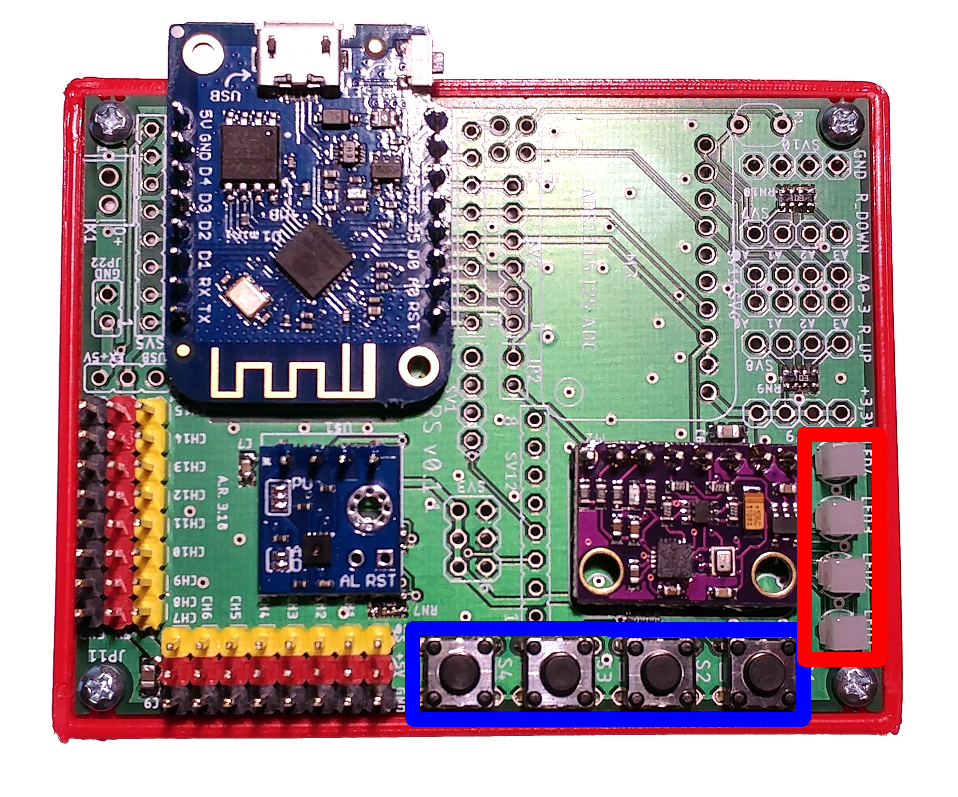
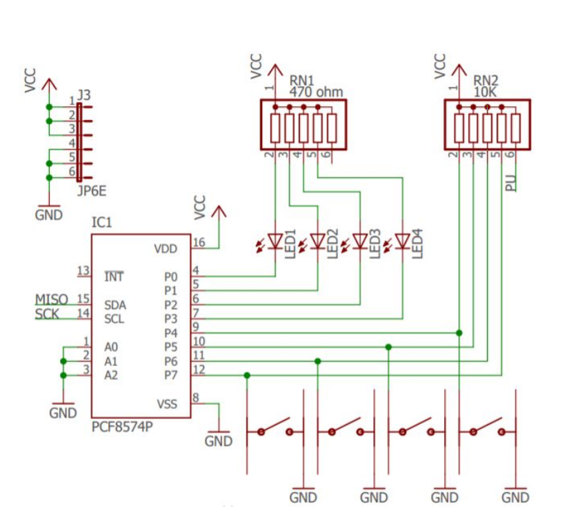

# Protokol I2C in njegova uporaba na ESP8266 v kombinaciji z 8-bitnimi vzporednimi V/I vrati

## I2C 

Na tokratni vaji bomo spoznali protokol Inter-Integrated Circuit (I2C).
To je eden izmed najbolj razširjenih protokolov za serijsko komunikacijo na
kratkih razdaljah, vsaj ko govorimo o mikrokrmilnikih oziroma vgrajenih sistemih. 
Protokol se pogosto uporablja za komunikacijo z različnimi senzorji in aktuatorji. 
S pomočjo tega protokola tako lahko komuniciramo npr. s temperaturnimi in ostalimi vremenskimi 
senzorji.

V nadaljevanju bomo najprej spoznali osnove protokola I2C ter njegov programski vmesnik 
v mikrokrmilniku ESP8266. Na koncu bomo spoznali še vzporedna V/I vrata (paralelni I/O port) 
PCF8574AN, ki jih najdemo na razvojni plošči in s katerim lahko komuniciramo z omenjenim protokolom.

## Protokol I2C 

Vsa integrirana vezja v I2C mreži si delijo vodilo, ki je sestavljeno iz dveh aktivnih 
dvosmernih linij (SCL in SDA) ter skupne mase. SDA služi za prenos ukazov in podatkov. 
SCL je urin signal, ki sinhronizira prenos ter hkrati določa hitrost komunikacije 
(fSCL<= 100 kHz: standardni način; 100 kHz < fSCL <= 400 kHz: hitri način). 
Vsako vezje, priključeno na vodilo, ima svoj naslov in, odvisno od svoje specifičnosti, 
lahko deluje kot sprejemnik in/ali kot oddajnik.

Komunikacijo upravlja nadzorna enota (gospodar - »master«) (najpogosteje je to mikrokrmilnik), ki generira 
takt, naslavlja podrejene enote (sužnji - »slaves«) in jim pošilja različne ukaze in podatke. 
Tudi podrejena enota lahko pošlje podatke proti nadzorni enoti, vendar samo takrat, ko nadzorna 
naprava to zahteva. Podatek se pošilja bit po bit in po vsakem 8. poslanem bitu sledi 9. SCL takt, 
v katerem sprejemna stran potrdi sprejem sporočila (ACK) tako, da SDA linijo potegne na logično 0.

Stran, ki pošilja podatke, mora postaviti naslednji bit na SDA linijo za toliko časa, dokler je 
SCL v stanju 0. Enako velja za ACK. Protokol I2C pozna dve posebni stanji vodila: START in STOP, 
ki se pojavita, če se stanje SDA linije spremeni, dokler je SCL v stanju 1:

``` 
SCL = 1, SDA = 1 ->0: START
``` 

``` 
SCL = 1, SDA = 0 ->1: STOP
``` 

Vsaka podrejena naprava mora imeti svoj naslov, ki je različen od naslovov ostalih naprav na vodilu. 
Pri nekaterih integriranih vezjih je naslov tovarniško vpisan v vezje, pri nekaterih se naslov 
lahko spreminja glede na postavljanje logičnih stanj na naslovnih priključkih (na primer pri 
PCF8574AN so to naslovni priključki A0, A1 in A2). Nekatera I2C vezja imajo 7-bitni naslov in 
8. bit (bit 0) predstavlja ukaz (bit 0 = 0: pisanje; bit 0 = 1: branje). Danes obstaja precej 
več I2C integriranih vezij kot jih 7-bitno naslavljanje omogoča, zato je naslavljanje nekaterih 
vezij 10-bitno. Oba načina naslavljanja sta medsebojno združljiva, tako da so lahko na vodilu I2C 
vezja s 7 ali 10-bitnim naslavljanjem.

Komunikacijo začenja nadzorna naprava z generiranjem signala START, nato sledi naslov vezja, 
ki ga kliče. START prebudi vsa vezja na vodilu in samo vezje, ki prepozna svoj naslov, odgovori 
s signalom ACK. Ostala vezja se deaktivirajo in čakajo naslednji signal START. Nadzorna naprava 
nadaljuje komunikacijo s klicanim vezjem, ki se konča s signalom STOP.

([Vir](https://svet-el.si/revija/samogradnje-revija/i2c-monitor/))


## I2C v ESP8266 s Arduino knjižnico

Na mikrokrmilniku ESP8266, ki ga uporabljamo na vajah, se SDA in SCL  nahajata na pinih 14 in 12. 
V Arduino knjižnici I2C komunikacijo podpirajo funkcije iz knjižnice **Wire.h** 
([Povezava](https://www.arduino.cc/en/Reference/Wire))

### Nastavljanje I2C komunikacije

Pred uporabo moramo I2C najprej inicializirati:
- določiti I2C pina (SDA in SCL), 
- nastaviti frekvenco vodila. 

Za inicializacijo komunikacije s podanima pinoma za uro in podatke uporabimo naslednji ukaz: 

```c 
Wire.begin(pin_SCL, pin_SDA);
```
Nastaviti moramo frekvenco ure v Hz. Za to uporabimo ukaz:

```c 
Wire.setClock(clock);
```
kjer je **clock** frekvenca ure v Hz.

Primer nastavljanja I2C komunikacije za ESP8266: 
Spodnji del kode boste vedno uporabili v funkciji **setup( )**.

```c 
  // Inicializiramo I2C na podanih pinih
  // SDA: pin 12
  // SDC: pin 14
  Wire.begin(12,14);
  // nastavimo frekvenco vodila na 100 kHz
  Wire.setClock(100000);
``` 

### I2C Branje 

Branje naprave na I2C vodilu poteka v dveh fazah:

1. Mikrokmilnik zahteva prenos podatkov od naprave 
   
  ```c
  Wire.requestFrom(naslov, dolžina);
  ```    
kjer *naslov* predstavlja naslov naprave, *dolžina* pa predstavlja število bajtov, 
ki se bodo prenašali do mikrokrmilnika

2. Naprava vrne prebrani bajt.

```c
uint8_t val = Wire.read();
```  

Primer: Kako prebrati en bajt z I2C naprave na naslovu 56 (0x38)?

```c
// Z naprave z naslovom 56 preberemo 1 byte
Wire.requestFrom(56, 1);
uint8_t val = Wire.read();
``` 

###  I2C pisanje

Pisanje podatkov v napravi na I2C vodilu poteka v treh fazah:

1. Prične pisanje/pošiljanje podatkov napravi na podanem naslovu. Podani naslov predstavlja 
vrednosti bitov 1-7, vrednost bita 0 funkcija nastavi samodejno.

```c
Wire.beginTransmission(naslov);
```  

2. Mikrokrmilnik pošlje 8 bitno vrednost val ali določeno število 8 bitnih vrednosti.
```c
Wire.write(val);
//ali
Wire.write(uint8_t buf[], dolžina);
```  

3. Mikrokrmilnik konča pisanje/pošiljanje podatkov napravi.
```c
Wire.endTransmission();
```  

Primer: Kako zapisati vrednost v I2C napravo z naslovom 56 (0x38)

```c 
// Na napravo z naslovom 56 zapišemo vredost val
Wire.beginTransmission(56);
Wire.write(val);
Wire.endTransmition();
``` 

## Periferija: Paralelni I/O port PCF8574AN

I2C protokol bomo preizkusili v praksi na senzorju I/O portu PCF8574AN, ta
periferija je namreč že integrirana na naši razvojni plošči. SDA in SDC pina I/O porta 
sta povezana na pina 12 in 14 mikrokrmilnika ESP8266. I/O port PCF8574AN se nahaja na 
spodnji strani tiskanega vezja in s pomočjo njega krmilimo zunanje LED in gumbe:

<p align="center">
    
</p>

Na I2C vodilu ima PCF8574AN naslov 0x20 po šestnajstiško ali 32 po desetiško. 
Na spodnjih 4 pinih PCF8574AN porta so povezane LED (P0 – P3), tipke pa so povezane na 
zgornjih 4 pinih, kot na sliki:

<p align="center">
    
</p>

PCF8574AN vsebuje samo en 8-bitni register, s pomočjo katerega krmilimo povezane LED in gumbe. 
Sedmi bit registra PCF8574AN ustreza pinu P7, šesti bit ustreza pinu P6 itd. 
Če želimo prižgeti LED diode, nastavljamo spodnje 4 bite. Če želimo odkriti stanje tipke, 
preberemo register in upoštevamo samo zgornje 4 bite. Ko je PCF8574AN povezan na vodilo I2C, 
lahko pišemo in beremo njegov register s pomočjo I2C komunikacije.

<p align="center">
    
</p>


Napotki za krmiljenje:

* Pisanje logične vrednosti 1 na P0–P3 LED ugasne, pisanje logične vrednosti 0 pa prižge:
  *  Če želimo prižgati LED1, pošljemo 0xFE 
  *  Če želimo prižgati LED2, pošljemo 0xFD 
  *  Če želimo prižgati LED3, pošljemo 0xFB 
  *  Če želimo prižgati LED4, pošljemo 0xF7 
*  Pred branjem vrednosti tipk je treba na P4–P7 zapisati logično 1. V primeru, da je bila tipka 
pritisnjena, se ustrezen bit postavi na logično 0.
   *  Če je gumb S1 pritisnjen, se 4. bit postavi na ničlo
   *  Če je gumb S2 pritisnjen, se 5. bit postavi na ničlo
   *  Če je gumb S3 pritisnjen, se 6. bit postavi na ničlo
   *  Če je gumb S4 pritisnjen, se 7. bit postavi na ničlo

## Program za krmiljenje PCF8574AN s pomočjo Ticker in I2C knjižnice


```c
#include <Wire.h>
#include <Ticker.h>

#define I2C_ADD_IO1 32

Ticker tickGUMB, tickLED;
uint8_t val;


void beriTipke();
void utripLED();

void setup() {
  // put your setup code here, to run once:
  Serial.begin(115200);

  // Inicializiramo I2C na podanih pinih
  // SDA: pin 12
  // SCL: pin 14
  Wire.begin(12,14);
  // nastavimo frekvenco vodila na 100 kHz
  Wire.setClock(100000);

  //tick.attach(1, posodobiParametre); 
  tickLED.attach_ms(500,utripLED); // Ticker za utrip LED diode. 
                                   // fukcija utripLED se kliče 
                                   // vsake 0.5 sekunde
  tickGUMB.attach_ms(500,beriTipke); // Ticker za utrip LED diode
}

/*
 * Funkcija za branje vrednosti tipk  
 */
void beriTipke(){
  // Preberi trenutno stanje tipk in ledic, stanja ledic ne želimo spreminjati.
  // Na pine, na katerih se nahajajo tipke, je potrebno zapisati logično enico.
 
  // Preberemo dejansko stanje tipk
  Wire.requestFrom(I2C_ADD_IO1, 1);
  val = (~(Wire.read()) & 0xF0)>>4;

  // Na serijskem ekranu se izpiše 2^n, 
  // n je zaporedna številka gumba
  Serial.println("Stanje gumbov: ");
  Serial.print(val);
  Serial.println(" ");

}

/*
 * Funkcija za utripanje LED1
 */
void utripLED(){
  static uint8_t LED_stanje = 0;
  LED_stanje = (LED_stanje + 1) % 2;
  Wire.beginTransmission (I2C_ADD_IO1);
  Wire.write(~LED_stanje);
  Wire.endTransmission();
}

void loop() {
  // put your main code here, to run repeatedly:

}
```

## Naloga

* Krmilite vse 4 LED diode in sicer tako, da se ustvari učinek neskončnega potovanja (najprej se prižge 1. LED, 
nato se 1. ugasne in prižge 2.; na koncu, ko se ugasne 4., pa se ponovno prižge 1.).
* S tipko 3 zmanjšujete frekvenco prižiganja LED diod, s tipko 4 pa frekvenco povečujete 
(stanje posodabljajte od 250 ms vse do 2000 ms, interval povečevanja pa naj znaša 250 ms).
* (*Opcijsko*): S tipko 1 zmanjšujete število sočasno prižganih LED diod (pričnete samo z eno 
diodo, ki je tudi najmanjše število, največ sočasno prižganih diod pa je 3), s tipko 2 pa 
število sočasno prižganih diod povečujete.

### Napotki:
* Uporabite en ticker za branje tipk (stanje tipk berite vsako sekundo), drugi ticker pa uporabite za 
posodabljanje LED (za spremembo intervala uporabite funkcijo detach() ter nato attach_ms()).  Primer:
  ```c
   // zmanjšaj periodo, če je pritisnjen gumb 1. val pove stanje gumba S1
  if (val & 1){
    if (interval_LED_ms > INTERVAL){
      interval_LED_ms -= INTERVAL; // izračunate interval
      Serial.print("Nov interval: ");
      Serial.println(interval_LED_ms);
      tickLED.detach(); // Izklopite Ticker
      tickLED.attach_ms(interval_LED_ms, posodobiLED); // Vklopite ticker z novo periodo
    }
  }  
  ```
* Implementirajte funkcijo za branje tipk, ki vrne vrednost tipk, biti vrnjene vrednosti pa naj predstavljajo, 
katera tipka je pritisnjena. Pred branjem vrednosti pa morate na pine, na katerih se nahajajo tipke, 
zapisati logično 1 (pazite, da ne spremenite stanja prižganih LED diod).
* Implementirajte funkcijo za posodabljanje prikaza LED diod. 
* Logične operacije v C/C++: 
    * http://en.cppreference.com/w/cpp/language/operator_logical
    * http://www.cplusplus.com/doc/tutorial/operators/
    * https://en.wikipedia.org/wiki/Operators_in_C_and_C%2B%2B
