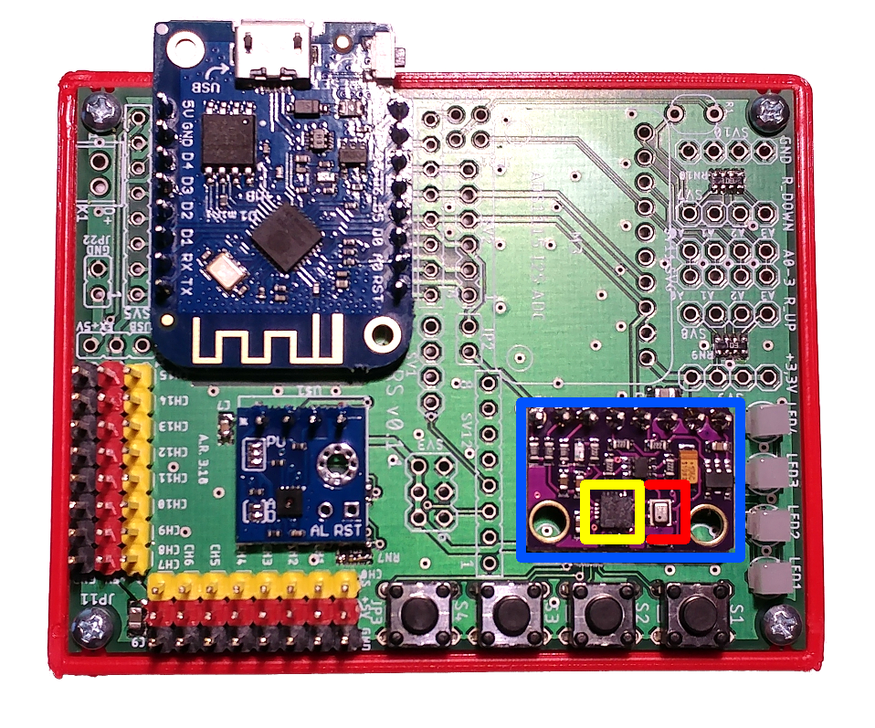
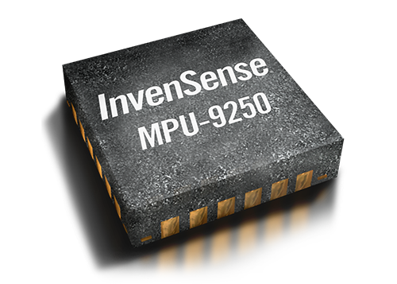

# MPU-9250 sensor as I2C slave

## Introduction

In this exercise, we will get to know the module MPU-9250, which can be used as an accelerometer, gyroscope and magnetometer. The MPU-9250 sensor resides on the GY-91 board (marked with blue colour).


<p align="center">
    
</p>


Besides the MPU-9250 sensor (marked with yellow colour), the GY-91 board includes the BMP850 temperature sensors (marked with red colour). We will more talk about the BMP850 in the following exercises. The focus of the seventh exercise is the MPU-9250 sensor. 

The measuring principle and design of specific sensors are very complex things to grasp and require knowledge from different areas.  The programmer needs only to be acquainted with the general principle of operation for a specific sensor. The most important thing to understand for him is the register map. By reading the sensor manuals or datasheet, the programmer needs to know the following:

1. Configuration registers and their usage
2. Registers which contain sensor data
3. How to calculate measurements from the obtained sensor data    


To initialize sensors, we need to write certain values to specific sensor registers. If we want to get sensor data, we need to read specific registers. The MPU-9250 sensor is connected with ESP8266 through I2C interface, so we will use the I2C protocol to read the data from the sensor.  


## Properties of MPU-9250 sensor

<p align="center">
    
</p>

MPU-9250 sensor consists of three different sensors:

* 3-axis accelerometer
* 3-axis gyroscope
* 3-axis magnetometer 

MPU-9250 properties:

* 16-bit analog digital (AD) converters
* Pogrammable digital filters
* Precise clock
* Embedded temperature sensor
* Communication: I2C and SPI protocol
* Voltage: 2.4 V to 3.6 V
* Motion Processing interrupt
* **Interface: I2C (up to 3,4 MHz)**
* **I2C address: 0b1110110**


## Accelerometer

### Meausuring principle and properties of accelerometer

An accelerometer measures proper acceleration, which is the acceleration it experiences relative to freefall and is the acceleration felt by people and objects.[2] Put another way, at any point in spacetime the equivalence principle guarantees the existence of a local inertial frame, and an accelerometer measures the acceleration relative to that frame.[4] Such accelerations are popularly denoted g-force; i.e., in comparison to standard gravity.
(Source: [Wikipedia](https://en.wikipedia.org/wiki/Accelerometer))

Properties:

* 16-bit resolution
* Range: ±2g (Default), ±4g, ±8g, ±16g
* Embedded 16-bit AD converter
* User programmable interrupts
* Wake-on-motion interrupt

### Register map 

| Address(HEX) | Address(DEC) |      Register name    |      Description     |
|:-----------:|:-----------:|:--------------:|:--------------:|
|    0x3B   |      59     | ACCEL_XOUT_H | X-axis acceleration - upper byte|
|    0x3C   |      60     | ACCEL_XOUT_L | X-axis acceleration - lower byte|
|    0x3D   |      61     | ACCEL_YOUT_H | Y-axis acceleration - upper byte|
|    0x3E   |      62     | ACCEL_YOUT_L | Y-axis acceleration - lower byte|
|    0x3F   |      63     | ACCEL_ZOUT_H | Z-axis acceleration - upper byte|
|    0x40   |      64     | ACCEL_ZOUT_L | Z-axis acceleration - lower byte|
|||||


## Gyroscope

### Meausuring principle and properties of hyroscope

Gyroscopes, or gyros, are devices that measure or maintain rotational motion. MEMS (microelectromechanical system) gyros are small, inexpensive sensors that measure angular velocity. The units of angular velocity are measured in degrees per second (°/s) or revolutions per second (RPS). Angular velocity is simply a measurement of speed of rotation.
(Source: [Sparkfun](https://learn.sparkfun.com/tutorials/gyroscope/all))


 Gyroscope properties:

* 16-bit resolution
* Range: ±250 (default), ±500, ±1000, and ±2000°/sec
* Software controlled low pass filter

### Register map 

| Address(HEX) | Address(DEC) |      Register name    |      Description     |
|:-----------:|:-----------:|:--------------:|:--------------:|
|    0x43   |      67     | GYRO_XOUT_H | Angular velocity in X-axis - upper byte|
|    0x44   |      68     | GYRO_XOUT_L | Angular velocity in X-axis - lower byte|
|    0x45   |      69     | GYRO_YOUT_H | Angular velocity in Y-axis - upper byte|
|    0x46   |      71     | GYRO_YOUT_L | Angular velocity in Y-axis - lower byte|
|    0x47   |      72     | GYRO_ZOUT_H | Angular velocity in Z-axis - upper byte|
|    0x49   |      73     | GYRO_ZOUT_L | Angular velocity in Z-axis - lower byte|
|||||

## Magnetometer 

### Meausuring principle and properties of magnetometer

A magnetometer is a device that measures magnetic field or magnetic dipole moment. Some magnetometers measure the direction, strength, or relative change of a magnetic field at a particular location. A compass is one such device, one that measures the direction of an ambient magnetic field, in this case, the Earth's magnetic field. Other magnetometers measure the magnetic dipole moment of a magnetic material such as a ferromagnet, for example by recording the effect of this magnetic dipole on the induced current in a coil.

(Source: [Wikipedia](https://en.wikipedia.org/wiki/Magnetometer#:~:text=A%20magnetometer%20is%20a%20device,field%20at%20a%20particular%20location.))


Properties:

* Hall's effect
* 14-bit resolution
* Range: ±4800 μT

## I2C in reading register

The I2C device can have more than one register that can be read. To read a specific register in I2C device, we need to do the following:

1. Address the I2C device
2. Send the address of the required register

In the following read of the I2C device, the microcontroller will receive the value of the required register. 

The following example illustrates the reading of register block of size NO_BYTE from address 40:


```c
// Address the I2C device
Wire.beginTransmission(I2C_DEV_ADDRESS);
// Specify the required sensor address
Wire.write(40);
// End transmission
Wire.endTransmission();

// We demand from I2C device to read NO_BYTE number of 8-bit registers 
Wire.requestFrom(I2C_DEV_ADDRESS, NO_BYTE);
for (int q = 0; q < NO_BYTE; q++) {
  // Read the value of following register:
  uint8_t value = Wire.read();
  // or:
  //uint32_t value = Wire.read();
}
``` 


## Assignment: 

* With the period of 10 Hz, read the angular velocity from the MPU92-50 sensor. Based on obtained measurements, calculate the orientation angle (on all axis) and print them on the serial terminal. 

* Control the external LEDs based on Z-axis orientation:
    - Angle between 0° and 89° -> turn on one LED
    - Angle between 90° and 179° -> turn on two LEDs 
    - Angle between 180° and 269° -> turn on three LEDs
    - Angle between 270° and 359° -> turn on four LEDs 


* (Optional): Read the temperature from sensor MPU-9250

### Tips:

* Use Ticker to read the sensor data
* You need to divide the sensor data with 131 (as stated in datasheet). The obtained value has a measurement unit in °/s (angular velocity)
* Use variables with type float to store the angular velocity 
