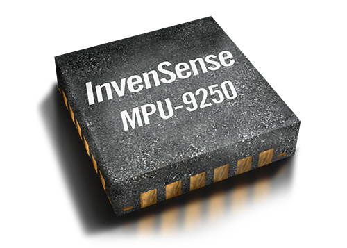

# Modul MPU-9250 kot suženj na vodilu I2C

## Uvod

Na tokratni vaji bomo spoznali modul MPU-9250, ki ga lahko uporabljamo kot senzor pospeška, giroskop in magnetometer. 
Senzor MPU-9250 se nahaja na ploščici GY-91, ki je na sliki označena z modro barvo.
<p align="center">
    
</p>
Poleg MPU-9250 (rumena barva), GY-91 vsebuje temperaturni senzor BMP850 (rdeča barva). Na naslednjih vajah bomo povedali nekaj več o senzorju BMP850. 
Zdaj nas zanima le MPU-9250.

Zgradba in notranje delovanje posameznih senzorjev sta precej kompleksna. Pri programiranju mikrokrmilnikov pa programerju vgrajenih 
sistemov ni potrebno poznati zgradbo senzorja, dovolj je, da pozna splošni princip delovanja. Za progamerja je najpomembneje poznati 
registrsko mapo senzorja ter namen (pomen) posameznih registrov. Drugač povedano, programer mora biti sposoben na podlagi tovarniške 
listine senzorja spoznati:

1. Registre za konfiguracijo senzorja in njihov pomen
2. Registre, ki vsebujejo meritve senzorja 
3. Kako na podlagi podatkov iz senzorja pretvoriti meritve senzorja v obliko, ki je primerna za vizualizacijo ali nadaljnjo obdelavo merilnih podatkov.

Če hočemo nastaviti senzor, moramo vpisati določene vrednosti v registre senzorja. 
Obratno, če hočemo dobiti merilne rezultate, moramo prebrati posamezne registre senzorja. 
Ker je MPU-9250 povezan z ESP8266 s pomočjo vmesnika I2C, bomo uporabili protokol I2C za prejemanje merilnih podatkov iz senzorja MP-9250. 


## Osnovne lastnosti modula MPU-9250

<p align="center">
    
</p>

Modul MPU-9250 vsebuje tri senzorje:

* 3-osni senzor pospeška 
* 3-osni giroskop
* 3-osni magnetometer 

Lastnosti MPU-9250:

* 16-bitni analogno-digitalni pretvorniki
* Programabilni digitalni filtri
* Precizna ura
* Vgrajeni senzor temperature
* Komunikacija: protokola I2C in SPI
* Napajalna napetost senzorja: od 2.4 V do 3.6 V
* Obdelava gibanja (angl. Motion Processing)
* **Vmesnik: I2C (do 3,4 MHz)**
* **Določanje naslova: 0b1101000**


## Senzor pospeška

### Princip delovanja in lastnosti senzorja pospeška 

Senzor pospeška (ang. accelerometer) je najboljpogosteje uporabljan senzor. Kot že samo ime pove, senzor pospeška meri pospešek, ki ga 
čuti naprava relativno glede na prosti pad (gravitacija, g=9,8m/s2). Ko se naprava sunkovito premakne v katerikoli smeri koordinatnega 
sistema X-Y-Z, se podatki iz senzorja 'našpičijo' in nato spet uležejo, ko napravo umirimo. Isti senzor se uporablja za določanje orientacije 
naprave vzdolž osi X-Y-Z, torej, ali je senzor obrnjen v pokončni ali ležeči legi in ali je senzor položen na hrbtno ali čelno stran.

Lastnosti senzorja pospeška:

* 16-bitna ločljivost
* Merilno območje: ±2g (privzeto), ±4g, ±8g, ±16g
* Vgrajen 16-bitni AD pretvornik
* Uporabniško-programirljive prekinitve
* Prekinitev Wake-on-motion

### Registri 

| Naslov(HEX) | Naslov(DEC) |      Ime  registra     |      Namen     |
|:-----------:|:-----------:|:--------------:|:--------------:|
|    0x3B   |      59     | ACCEL_XOUT_H | Pospešek v smeri X-osi - višji bajt|
|    0x3C   |      60     | ACCEL_XOUT_L | Pospešek v smeri X-osi - nižji bajt|
|    0x3D   |      61     | ACCEL_YOUT_H | Pospešek v smeri Y-osi - višji bajt|
|    0x3E   |      62     | ACCEL_YOUT_L | Pospešek v smeri Y-osi - nižji bajt|
|    0x3F   |      63     | ACCEL_ZOUT_H | Pospešek v smeri Z-osi - višji bajt|
|    0x40   |      64     | ACCEL_ZOUT_L | Pospešek v smeri Z-osi - nižji bajt|
|||||


## Giroskop

### Princip dela in lastnosti giroskopa

Giroskop ali tudi žiroskop je naprava, ki za svoje delovanje uporablja načelo ohranitve vrtilne količine. 
Je v bistvu simetrična vrtavka, ki se giblje okrog stacionarne točke. Trenje pri vsem tem zanemarimo, prav tako zanemarimo vse zunanje sile. 
Vrteči se giroskop se upira vsem spremembam smeri gibanja. Giroskopi so danes nepogrešljiv del v elektronskih napravah, na primer tablicah 
in telefonih, saj brez njih marsikatera aplikacija (virtualna resničnost, virtualen sprehod po prostoru, 360° pogled ...) ne bi delovala.


Lastnosti giroskopa:

* 16-bitna ločljivost
* Merilno območje: ±250 (privzeto), ±500, ±1000, and ±2000°/sec
* Programsko nastavljiv nizkoprepustni filter

### Registri 

| Naslov(HEX) | Naslov(DEC) |      Naziv registra     |      Namen     |
|:-----------:|:-----------:|:--------------:|:--------------:|
|    0x43   |      67     | GYRO_XOUT_H | Kotna hitrost v smeri X-osi - višji bajt|
|    0x44   |      68     | GYRO_XOUT_L | Kotna hitrost  v smeri X-osi - nižji bajt|
|    0x45   |      69     | GYRO_YOUT_H | Kotna hitrost  v smeri Y-osi - višji bajt|
|    0x46   |      70     | GYRO_YOUT_L | Kotna hitrost  v smeri Y-osi - nižji bajt|
|    0x47   |      71     | GYRO_ZOUT_H | Kotna hitrost  v smeri Z-osi - višji bajt|
|    0x49   |      72     | GYRO_ZOUT_L | Kotna hitrost  v smeri Z-osi - nižji bajt|
|||||

## Magnetometer 

### Princip dela in lastnosti magnetometra

Magnetometer je naprava, ki meri magnetizem, bodisi magnetizacijo magnetnega materiala (recimo feromagneta) ali pa meri usmerjenost, 
jakost in relativno spremembo magnetnega polja. Kompas je enostaven magnetometer, ki meri usmerjenost okoljskega magnetnega polja (Zemlje). 
Magnetometri se lahko uporabljajo tudi kot detektorji kovine, s tem, da je njihov doseg precej večji od navadnih detektorjev kovin. 
Magnetometri lahko zaznajo večje kovinske objekte kot npr. avto, ki je zakopan do 10 m globoko (povzeto po Wikipediji).

Lastnosti magnetometra:

* Dela na principu Hallovega efekta
* 14-bitna ločljivost
* Merilno območje: ±4800 μT

## I2C in branje registrov

Naprava lahko vsebuje več registrov za branje, v katere pa lahko tudi pišemo (če je to dovoljeno). Če želimo prebrati posamezen register 
v napravi, moramo:

1. Nasloviti napravo (senzor)
2. Sporočiti naslov zahtevanega registra
   
Pri naslednjem branju I2C naprave bo mikrokrmilnik prejel vrednost zahtevanega registra od naprave. 

Primer branja bloka registrov (velikosti ST_BAJTOV) od naslova registra 40 dalje:

```c
// Naslovimo napravo, s katero želimo komunicirati:
Wire.beginTransmission(I2C_NASLOV_NAPRAVE);
// Napravi sporočimo naslov registra, s katerega želimo brati:
Wire.write(40);
// Končamo prenos:
Wire.endTransmission();

// Napravi sporočimo, da želimo prebrati določeno število 8-bitnih registrov:
Wire.requestFrom(I2C_NASLOV_NAPRAVE, ST_BAJTOV);
for (int q = 0; q < ST_BAJTOV; q++) {
  // Preberemo naslednji 8-bitni register oz. naslednji bajt:
  uint8_t vrednost = Wire.read();
  // ali:
  //uint32_t vrednost = Wire.read();
}
``` 


## Naloga: 

* S periodo 10 Hz berite vrednosti z MPU-9250 (privzeta konfiguracija) in na podlagi vrednosti pospeškometra izračunajte pospešek po oseh 
x, y in z (bodite previdni, kaj preberete z registrov naprave, oz. katero enoto ima vrednost). Izračunane vrednosti izpisujte preko serijskega 
monitorja.

* Na podlagi pospeska na X in Y osi implementirajte digitalno vodno tehtnico.
   
* (Opcijsko): S pomočjo dokumentacije izračunajte temperaturo v MPU-9250 vgrajenega senzorja.

### Namig:

* Za periodično klicanje lahko uporabite Ticker.

