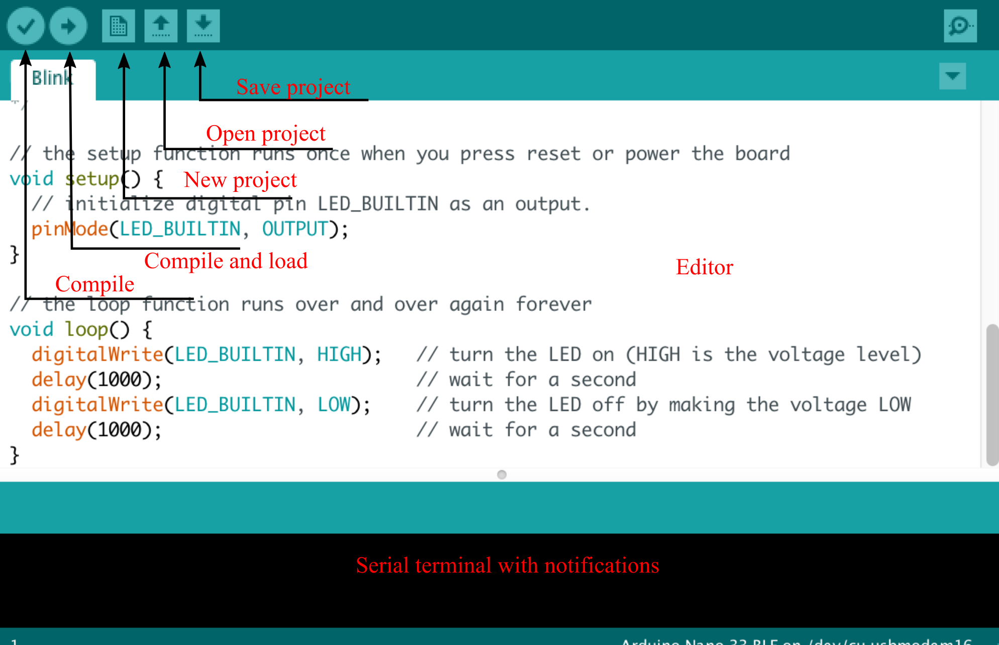

# 5. WEMOS D1: basics

In this exercise, we will get to know Arduino IDE, and we will load our first program on the WeMos D1 board.

Some features of WeMos D1 board:

* Microcontroller: ESP8266
* Frequency: 80 MHz (160 MHz)
* Flash: 4 MB
* Supply voltage: 3,3 V
* Digital inputs outputs: 11
* Analogue inputs: 1 (napetost <= 3,2 V)

### WeMos D1 mini connection  

| Wemos Pin  | Function                            | ESP8266 Pin |
|------------|-------------------------------------|-------------|
| TX         | TXD (Sending data       )           | TXD         |
| RX         | RXD (Receiving data)              | RXD         |
| A0         | Analogue input, <= 3,2 V             | A0          |
| D0         | IO (Input/Output)                     | GPIO16      |
| D1         | IO, SCL (I2C communication)          | GPIO5       |
| D2         | IO, SDA (I2C communication)          | GPIO4       |
| D3         | IO, with 10k pull-up resistor            | GPIO0       |
| D4         | IO, with 10k pull-up resistor, LED dioda | GPIO2       |
| D5         | IO, SCK (SPI communication)          | GPIO14      |
| D6         | IO, MISO (SPI communication)         | GPIO12      |
| D7         | IO, MOSI (SPI communication)         | GPIO13      |
| D8         | IO, with 10k pull-down resistor          | GPIO15      |
| G          | Ground                  | GND         |
| 5V         | 5 V                                 | -           |
| 3V3        | 3,3 V                               | 3,3 V       |
| RST        | Reset                               | RST         |


## 5.1 Arduino IDE and ESP8266

### Download the latest versions:
  
  - *[Download link](https://www.arduino.cc/en/Main/Software)*
    - Windows:
      - Set »Windows app« on PC


### Serial port set-up

- Linux (e.g. Ubuntu):
  -  Shell command:  `sudo adduser $USER dialout`
  -  After that, you need to restart PC.

### Arduino IDE

<p align="center">
    
</p>

### Setting up additional libraries:

  - Open *Arduino IDE -> File -> Preferences ->
Settings -> "Additional Boards Manager URLs:"*
(Add link:)
  **http://arduino.esp8266.com/stable/package_esp8266com_index.json**
- *Arduino IDE -> Tools -> Board: "\*" -> Board
Manager ->* (search field:) esp8266 -> select
 "*esp8266 by ESP8266 Comunity"
-> Install* (By default, the program chooses the latest version) -> *Close*

### Setting additional libraries:

- *Arduino IDE -> Tools -> Board: "\*" -> Wemos D1 R2 & mini*
- Everything that is marked with * is default values. You don't need to change them
- Arduino IDE -> Tools:
  - \* Flash Size: "4M(1M SPIFFS)"
  - \* Debug port: "Disabled"
  - \* Debug Level: "None"
  - \* lwIP Variant: "V2 Prebuilt (MSS=536)"
  - \* CPU Frequency: "80 MHz"
  - \* Upload speed: "921600"


## 5.2 Arduino Hello_world

```c
void setup() {
  // This part only executes once 

  // Example of serial communication
  Serial.begin(115200); 		// Speed of serial communication
  Serial.println("Hello from setup()"); // Print on serial terminal
}


void loop() {
  // This part executes in an infinite loop 

  Serial.println("Hello from loop()"); //  Print on serial terminal
}

```

Every Arduino program has two parts:

1. Function ``` setup()``` executes only once, at the start of the program. In most of the programs, we use the function  ``` setup()``` or pin assignment, serial communication and peripheral devices. We can also set the interrupts that come from hardware or software. In the previous example, we set the speed of the serial communication at 11520 baud per second. 
Besides that, we write the string  "Hello from setup()" on the serial terminal.\

2. Function ``` loop()``` consecutively. 
In the function  ``` loop()```, we write code that implements the assignment, for example, reading and writing to pins,  sending and receiving data over I2C, controlling servo motors, etc. In our example, we write the string "Hello from loop()" on the serial terminal.

### Variable types

| Type                     | Description                      | Length in bits |
|--------------------------|----------------------------|-------------------|
| uint8_t, unsigned char   | Unsigned byte          | 8                 |
| int8_t, char             | Signed byte            | 8                 |
| uint16_t, unsigned short | Unsigned two bytes    | 16                |
| int16_t, short           | Signed two bytes      | 16                |
| uint32_t, unsigned int   | Unsigned four bytes | 32                |
| int32_t, int             | Signed four bytes   | 32                |
| uint64_t, unsigned long  | Unsigned eight bytes | 64                |
| Int64_t, long            | Signed eight bytes   | 64                |
| float                    | Floating point   | 32                |


### Additional materials:

1. Function setup ([Link](https://www.arduino.cc/reference/en/language/structure/sketch/setup/))
2. Function loop ([Link](https://www.arduino.cc/reference/en/language/structure/sketch/loop/))
3. Serial communication ([Link1](https://www.arduino.cc/reference/en/language/functions/communication/serial/begin)) ([Link2](https://www.arduino.cc/reference/en/language/functions/communication/serial/println))

## 5.3 General purpose Input Output (GPIO)


Before we start using GPIO, we need to assign their roles: input or output.  

### Vhod 
To define the GPIO role, we use the following function:

```c
pinMode(pin, mode)
```
where *pin* represent pin number, which we want to use, *mode* defines GPIO role

* ```INPUT```  	-> GPIO is set as input
* ```INPUT_PULLUP```  	-> GPIO is set as input with pull-up resistor
* ```OUTPUT```  	-> GPIO is set as output

We can read the GPIO input with the function.  ```digitalRead()```.
The following code illustrates the usage of the function ```digitalRead()```:

```c
...
pinMode(pinIn, INPUT);
...
int pinState;
pinState = digitalRead(pinIn);
...
```

After the execution, the state of GPIO *pinIn* is saved in variable *pinState*.


With the function ```digitalWrite()```, we can set the chosen GPIO on certain value (0 or 1). The following code illustrates the usage of function ```digitalWrite()```


```c
...
pinMode(pinOut, OUTPUT);
...
int outputValue = 1;
digitalWrite(pinOut,outputValue);
...

```

### Simple example

The following example illustrates the usage of functions ```pinMode(pin, mode)```, ```digitalRead()```  in ```digitalWrite()```. In the example, we first read the GPIO *inPin* and write its state to the output GPIO *outPin*. 


```c
int outPin = 13;  
int inPin = 7;    
int val = 0;     

void setup() {              // We assigned GPIO roles in the setup() function
  pinMode(outPin, OUTPUT);  // We set outPin as output
  pinMode(inPin, INPUT);    // We set inPin as input
}

void loop() {
  val = digitalRead(inPin);   // We read the inPin
  digitalWrite(outPin, val);  // We write the outPin
  delay(500); 		     // Software delay 
```

### Additional materials:

1. GPIO assignments ([Link](https://www.arduino.cc/reference/en/language/functions/digital-io/pinmode/))
2. Read GPIO ([Link](https://www.arduino.cc/reference/en/language/functions/digital-io/digitalread/))
3. Write GPIO ([Link](https://www.arduino.cc/reference/en/language/functions/digital-io/digitalwrite/)) 
4. Delay  ([Link](https://www.arduino.cc/reference/en/language/functions/time/delay/)) 


## 5.4 Repeating functions call

 *Ticker* objects enable  repeating call of functions. Following example illustrates the usage of *Ticker* objects.

```c
#include <Ticker.h>  // Ticker knjižnica
 
Ticker blinker;
 
#define OUT 2  

int val;

//=======================================================================
void change_state()
{
  digitalWrite(OUT, 1);  
  delay(1000);           	// Wait 1s
  digitalWrite(OUT, 0);   
  delay(1000);                	// Wait 1s 
}
//=======================================================================
void setup()
{
    Serial.begin(115200);
    Serial.println("");
 
    pinMode(OUT,OUTPUT);  	// Set GPIO OUT as output
 
    blinker.attach(0.5, change_state);  // Program executes change_state
                                        // every 0.5 s
}

//=======================================================================
void loop()
{
}
```

We need to remember two things:

1. Declare the object *Ticker*
   ```c
   Ticker blinker; 
   ``` 
2. Set the object *ticker*. Pass the name of the function, which will be periodically executed. 
    ```c
    blinker.attach(0.5, change_state);   // Program executes change_state
                                         // every 0.5 s

   ```
    Program executes change_state every 0.5 s.


## 5.5 Home assignment

* The built-in LED light should blink five times at the given frequency. After that, increase the frequency by 1 Hz. The starting frequency is 1 Hz, and increase it up to 5Hz, then repeat everything. Print the status via the serial terminal. Create two stand-alone programs (projects), and implement the effect with the use of :

  *  Software delay (delay()),
  *  Ticker objects (Ticker).


### Tip: 

The built-in LED light is connected to GPIO pin 2 of ESP8266.
